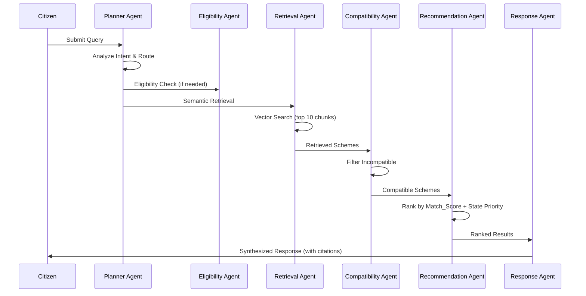
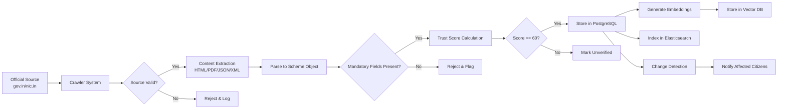
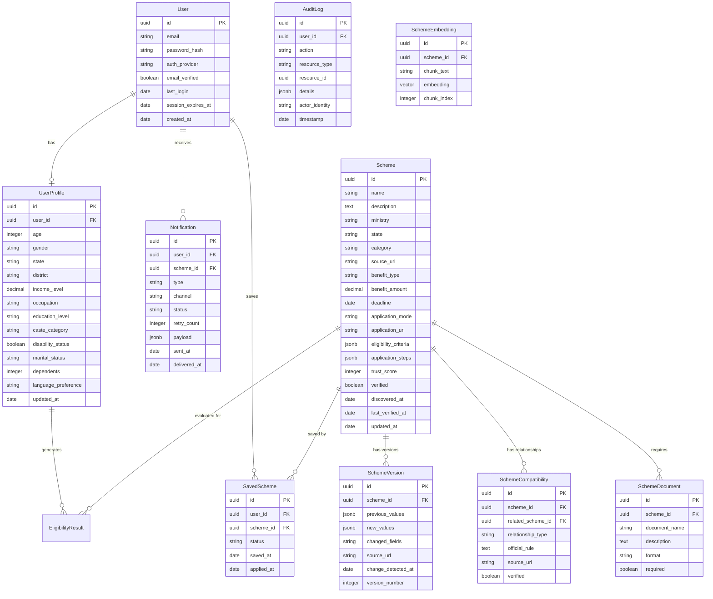

# Technical Design Document

## Overview

Bharat Benefits AI is a full-stack AI-powered platform that helps Indian citizens discover, understand, and apply for government welfare schemes. The system ingests scheme data exclusively from verified official government sources (gov.in, nic.in domains), calculates eligibility using AI, provides personalized recommendations, and answers citizen questions via a RAG-based multi-agent AI pipeline.

The platform is designed as a mobile-first, multilingual web application with a multi-agent AI backend. Key architectural drivers include:

- **Data Trust**: All scheme data originates from verified official sources with trust scoring
- **AI-First Processing**: Multi-agent pipeline for query processing, eligibility calculation, and recommendations
- **Scalability**: Supporting 10,000+ concurrent users with sub-3-second response times
- **Accessibility**: WCAG 2.1 AA compliance with multilingual and voice support in 6 Indian languages
- **Security**: AES-256 encryption at rest, TLS 1.2+ in transit, session management, and audit logging

### Technology Stack

| Layer | Technology | Rationale |
|-------|-----------|-----------|
| Frontend | Next.js 14 (React) | Mobile-first SSR, i18n support, performance optimization |
| Backend API | Node.js with Express/Fastify | High concurrency, async I/O for AI pipeline orchestration |
| Database | PostgreSQL | Relational data for schemes, users, compatibility; JSONB for flexible schema data |
| Vector Database | Pinecone / pgvector | Semantic search for RAG retrieval |
| Cache | Redis | Session management, API response caching, rate limiting |
| AI/LLM | OpenAI GPT-4 / Azure OpenAI | RAG generation, eligibility reasoning, multi-agent orchestration |
| Embeddings | OpenAI text-embedding-3-small | Scheme data vectorization for semantic search |
| Search | Elasticsearch | Full-text search for scheme discovery and filtering |
| Crawler | Node.js worker processes | Scheduled crawling with Puppeteer/Cheerio for HTML, pdf-parse for PDFs |
| Notifications | AWS SES (email), WebSocket (in-app) | Multi-channel notification delivery |
| Voice | Azure Cognitive Services Speech | STT/TTS with Indian language support |
| Translation | Azure Translator / Google Cloud Translation | Multilingual content delivery |
| Authentication | NextAuth.js with JWT | Email/password + social login, session management |
| Observability | OpenTelemetry + Jaeger | Distributed tracing for multi-agent pipeline |
| Hosting | AWS (ECS/EKS) | Auto-scaling, high availability |
| CI/CD | GitHub Actions | Automated testing and deployment |
| Testing | Vitest + fast-check | Unit tests, property-based tests |

## Architecture

### High-Level Architecture Diagram

```mermaid
graph TB
    subgraph Client["Client Layer"]
        WebApp["Next.js Web App<br/>(Mobile-First PWA)"]
        VoiceUI["Voice Interface"]
    end

    subgraph API["API Gateway Layer"]
        Gateway["API Gateway<br/>(Rate Limiting, Auth)"]
    end

    subgraph Services["Service Layer"]
        AuthService["Auth Service"]
        SchemeService["Scheme Service"]
        ProfileService["Profile Service"]
        EligibilityService["Eligibility Service"]
        RecommendationService["Recommendation Service"]
        NotificationService["Notification Service"]
        ComparisonService["Comparison Service"]
    end

    subgraph AI["AI Layer (Multi-Agent)"]
        PlannerAgent["Planner Agent"]
        EligibilityAgent["Eligibility Agent"]
        RetrievalAgent["Retrieval Agent"]
        CompatibilityAgent["Compatibility Agent"]
        RecommendationAgent["Recommendation Agent"]
        ResponseAgent["Response Agent"]
    end

    subgraph Data["Data Layer"]
        PostgreSQL["PostgreSQL<br/>(Schemes, Users, Compatibility)"]
        VectorDB["Vector Database<br/>(Embeddings)"]
        Redis["Redis<br/>(Cache, Sessions)"]
        Elasticsearch["Elasticsearch<br/>(Full-Text Search)"]
    end

    subgraph Background["Background Workers"]
        Crawler["Crawler System"]
        ChangeDetector["Change Detector"]
        DeadlineTracker["Deadline Tracker"]
        MissedAnalyzer["Missed Benefits Analyzer"]
    end

    WebApp --> Gateway
    VoiceUI --> Gateway
    Gateway --> AuthService
    Gateway --> Services
    Services --> AI
    Services --> Data
    AI --> Data
    Background --> Data
    Crawler --> PostgreSQL
    Crawler --> VectorDB
    Crawler --> Elasticsearch
</graph>
```

### Multi-Agent Pipeline Flow



### Data Flow: Scheme Ingestion Pipeline



## Components and Interfaces

### 1. Crawler System

**Purpose**: Automated discovery and ingestion of scheme data from official government sources.

```typescript
interface CrawlerSystem {
  // Core operations
  executeDailyCrawl(): Promise<CrawlResult>;
  discoverNewSchemes(sourceUrls: string[]): Promise<DiscoveredScheme[]>;
  processScheme(rawData: RawSchemeData): Promise<ProcessedScheme>;
  
  // Validation
  validateSource(url: string): boolean; // checks gov.in, nic.in domains
  calculateTrustScore(scheme: ProcessedScheme): number; // 0-100
  
  // Parsing
  parseHTML(content: string): SchemeData;
  parsePDF(buffer: Buffer): SchemeData; // up to 50MB
  parseJSON(content: string): SchemeData;
  parseXML(content: string): SchemeData;
  
  // Compatibility extraction
  extractCompatibilityRelationships(scheme: ProcessedScheme): CompatibilityRelation[];
}

interface CrawlResult {
  newSchemes: number;
  updatedSchemes: number;
  failedSources: FailedSource[];
  duration: number; // milliseconds
  completedAt: Date;
}
```

### 2. Eligibility Engine

**Purpose**: Calculates citizen eligibility for schemes based on profile data and official criteria.

```typescript
interface EligibilityEngine {
  calculateEligibility(
    userProfile: UserProfile,
    scheme: Scheme
  ): EligibilityResult;
  
  recalculateAllSavedSchemes(userId: string): Promise<EligibilityResult[]>;
  
  evaluateCriterion(
    criterion: EligibilityCriterion,
    profileValue: any
  ): CriterionResult;
}

interface EligibilityResult {
  status: 'Eligible' | 'Partially Eligible' | 'Not Eligible';
  metCriteria: CriterionEvaluation[];
  unmetCriteria: CriterionEvaluation[];
  unevaluatedCriteria: UnevaluatedCriterion[];
  missingProfileFields: string[];
}

interface CriterionEvaluation {
  criterionName: string;
  requirement: string;
  profileValue: any;
  met: boolean;
}
```

### 3. Recommendation Engine

**Purpose**: Generates personalized, state-aware scheme recommendations ranked by relevance.

```typescript
interface RecommendationEngine {
  generateRecommendations(userId: string): Promise<Recommendation[]>;
  calculateMatchScore(userProfile: UserProfile, scheme: Scheme): number; // 0-100
  
  applyStateAwarePrioritization(
    recommendations: Recommendation[],
    userState: string
  ): Recommendation[];
}

interface Recommendation {
  schemeId: string;
  matchScore: number; // 0-100
  benefitAmount: number | null;
  deadline: Date | null;
  explanation: string; // max 200 chars
  priorityGroup: 'state' | 'central' | 'other';
}
```

### 4. Scheme Assistant (RAG)

**Purpose**: Answers citizen questions using retrieved scheme data with source citations.

```typescript
interface SchemeAssistant {
  answerQuery(
    query: string,
    sessionId: string,
    language: SupportedLanguage
  ): Promise<AssistantResponse>;
  
  retrieveContext(query: string): Promise<RetrievedChunk[]>;
  detectLanguage(text: string): { language: SupportedLanguage; confidence: number };
}

interface AssistantResponse {
  answer: string; // max 500 words
  sources: SourceCitation[];
  language: SupportedLanguage;
  traceId: string;
}

interface SourceCitation {
  schemeId: string;
  schemeName: string;
  sourceUrl: string;
  lastUpdated: Date;
}
```

### 5. Multi-Agent Pipeline

**Purpose**: Orchestrates specialized AI agents for comprehensive query processing.

```typescript
interface MultiAgentPipeline {
  processQuery(query: string, userId: string): Promise<PipelineResult>;
}

interface PlannerAgent {
  analyzeIntent(query: string): AgentRoutingPlan;
}

interface AgentRoutingPlan {
  queryType: 'eligibility' | 'recommendation' | 'information' | 'comparison';
  requiredAgents: AgentName[];
  skippedAgents: AgentName[];
}

interface PipelineResult {
  response: string;
  sources: SourceCitation[];
  traceId: string;
  agentOutputs: Map<AgentName, AgentOutput>;
  totalDuration: number; // milliseconds
}
```

### 6. Compatibility Engine

**Purpose**: Manages scheme relationships and compatibility checks.

```typescript
interface CompatibilityEngine {
  getRelationships(schemeId: string): SchemeRelationship[];
  checkCompatibility(schemeIdA: string, schemeIdB: string): CompatibilityCheck;
  getPrerequisites(schemeId: string): PrerequisiteChain;
}

interface SchemeRelationship {
  relatedSchemeId: string;
  relatedSchemeName: string;
  type: 'can_combine_with' | 'cannot_combine_with' | 'prerequisite_schemes';
  officialRule: string;
  sourceUrl: string;
}

interface CompatibilityCheck {
  compatible: boolean;
  rule: string | null;
  sourceUrl: string | null;
}
```

### 7. Notification Service

**Purpose**: Multi-channel notification delivery with retry logic.

```typescript
interface NotificationService {
  sendDeadlineNotification(userId: string, scheme: Scheme, daysUntil: number): Promise<void>;
  sendChangeNotification(userId: string, change: SchemeChange): Promise<void>;
  sendReopeningNotification(userId: string, scheme: Scheme): Promise<void>;
  
  deliverEmail(notification: Notification): Promise<DeliveryResult>;
  deliverInApp(notification: Notification): Promise<DeliveryResult>;
  retryFailedDelivery(notificationId: string, attempt: number): Promise<void>;
}
```

### 8. Benefits Dashboard Service

**Purpose**: Aggregates and tracks citizen benefit status and estimated values.

```typescript
interface BenefitsDashboardService {
  getDashboard(userId: string): Promise<Dashboard>;
  markAsApplied(userId: string, schemeId: string): Promise<void>;
  saveScheme(userId: string, schemeId: string): Promise<void>;
  calculateEstimatedBenefitValue(userId: string): number; // INR
}

interface Dashboard {
  eligible: SchemeWithStatus[];
  applied: SchemeWithStatus[];
  saved: SchemeWithStatus[];
  expired: SchemeWithStatus[];
  estimatedTotalBenefitValue: number; // INR, monetary only
  missedBenefitsSummary: MissedBenefitsSummary;
  counts: { eligible: number; applied: number; saved: number; expired: number };
}
```

### 9. Voice Assistant Service

**Purpose**: Speech-to-text and text-to-speech in Indian languages.

```typescript
interface VoiceAssistantService {
  speechToText(audio: Buffer, language: SupportedLanguage): Promise<STTResult>;
  textToSpeech(text: string, language: SupportedLanguage): Promise<Buffer>;
}

interface STTResult {
  text: string;
  confidence: number; // 0-100
  language: SupportedLanguage;
}
```

### 10. User Profile Service

**Purpose**: Manages citizen profiles with validation and encryption.

```typescript
interface UserProfileService {
  createProfile(data: CreateProfileInput): Promise<UserProfile>;
  updateProfile(userId: string, data: UpdateProfileInput): Promise<UserProfile>;
  deleteProfile(userId: string): Promise<void>; // 30-day deletion
  validateProfileData(data: Partial<UserProfile>): ValidationResult;
}

interface ValidationResult {
  valid: boolean;
  errors: FieldValidationError[];
}

interface FieldValidationError {
  field: string;
  value: any;
  reason: string;
}
```

## Data Models

### Core Entities



### Key Data Structures

```typescript
// Supported Languages
type SupportedLanguage = 'en' | 'hi' | 'bn' | 'ta' | 'te' | 'mr';

// Scheme Categories
type SchemeCategory = 
  | 'Education' | 'Agriculture' | 'Healthcare' | 'Women'
  | 'Employment' | 'Skill Development' | 'Housing' | 'Startups'
  | 'MSME' | 'Pension' | 'Scholarships' | 'Financial Assistance';

// User Profile Validation Constraints
interface ProfileConstraints {
  age: { min: 0, max: 150 };
  income: { min: 0, max: 9999999999 }; // INR
  dependents: { min: 0, max: 20 };
  gender: ['Male', 'Female', 'Other'];
  occupation: ['Farmer', 'Student', 'Salaried', 'Self-Employed', 'Unemployed', 'Retired', 'Other'];
  education: ['None', 'Primary', 'Secondary', 'Higher Secondary', 'Graduate', 'Post-Graduate', 'Doctorate'];
  caste: ['General', 'OBC', 'SC', 'ST'];
  maritalStatus: ['Single', 'Married', 'Widowed', 'Divorced', 'Separated'];
  requiredFields: ['age', 'gender', 'state', 'income'];
}

// Trust Score Thresholds
interface TrustScoreConfig {
  minimumForDisplay: 60;
  range: { min: 0, max: 100 };
}

// Scheme Status for Dashboard
type SchemeStatus = 'Eligible' | 'Applied' | 'Saved' | 'Expired';

// Scheme Object (Serialization Target)
interface SchemeObject {
  // Mandatory fields
  name: string;
  description: string;
  eligibilityCriteria: EligibilityCriterion[];
  benefits: Benefit[];
  sourceUrl: string;
  ministry: string;
  
  // Optional fields
  applicationProcess: ApplicationStep[] | null;
  requiredDocuments: DocumentRequirement[] | null;
  deadline: Date | null;
}

interface EligibilityCriterion {
  field: string;
  operator: 'eq' | 'neq' | 'gt' | 'gte' | 'lt' | 'lte' | 'in' | 'between';
  value: any;
  description: string;
}

interface Benefit {
  type: 'monetary' | 'non-monetary';
  amount: number | null; // INR for monetary
  description: string;
}

// Password Validation
interface PasswordPolicy {
  minLength: 8;
  maxLength: 128;
  requireUppercase: true;
  requireLowercase: true;
  requireDigit: true;
  requireSpecialChar: true;
}
```


## Correctness Properties

*A property is a characteristic or behavior that should hold true across all valid executions of a system — essentially, a formal statement about what the system should do. Properties serve as the bridge between human-readable specifications and machine-verifiable correctness guarantees.*

### Property 1: Source URL Validation

*For any* URL string, the source validation function SHALL accept the URL if and only if its domain ends with `gov.in` or `nic.in` or belongs to the configured list of official ministry/state portals, and SHALL reject all other URLs.

**Validates: Requirements 1.1, 1.2**

### Property 2: Trust Score Bounds and Visibility

*For any* scheme processed by the Crawler_System, the assigned Trust_Score SHALL be an integer in the range [0, 100], and the scheme SHALL be visible to citizens if and only if its Trust_Score is greater than or equal to 60.

**Validates: Requirements 1.6, 1.7**

### Property 3: Scheme Metadata Completeness on Ingestion

*For any* successfully ingested scheme, the stored record SHALL contain non-null values for source URL, ministry/department name, date discovered, last verified date, and Trust_Score.

**Validates: Requirements 1.3**

### Property 4: Filter AND Logic

*For any* set of schemes and any combination of active filters (State, Income Level, Category, Age, Gender, Occupation, Benefit Type), every scheme in the returned result set SHALL satisfy ALL active filter criteria simultaneously.

**Validates: Requirements 2.3**

### Property 5: Search Result Ordering

*For any* search query of at least 2 characters and any scheme dataset, the returned result list SHALL be sorted in non-ascending order by match relevance score against scheme name, category, and description.

**Validates: Requirements 2.6**

### Property 6: User Profile Validation

*For any* submitted User_Profile data, the validation function SHALL accept the submission if and only if: all required fields (age, gender, state, income) are present, age is an integer in [0, 150], income is in [0, 9999999999], gender is one of {Male, Female, Other}, state is from the valid list, and all optional fields that are present have values within their defined valid sets. For any invalid submission, the function SHALL return errors identifying each failing field and the reason for failure.

**Validates: Requirements 3.1, 3.2, 3.4**

### Property 7: Eligibility Calculation Correctness

*For any* valid User_Profile and any Scheme with defined eligibility criteria, the Eligibility_Engine SHALL produce a result where: (a) status is exactly one of {Eligible, Partially Eligible, Not Eligible}, (b) if status is "Not Eligible" then at least one criterion is listed as unmet with the criterion requirement and profile value, (c) if status is "Partially Eligible" then at least one criterion is met and at least one criterion cannot be evaluated with specific missing profile fields identified, and (d) if status is "Eligible" then all evaluable criteria are met.

**Validates: Requirements 4.1, 4.2, 4.3, 4.5**

### Property 8: Recommendation Ranking Order

*For any* list of recommendations returned by the Recommendation_Engine, the list SHALL be ordered such that: (a) within the same priority group, schemes are sorted by Match_Score descending, then by Benefit Amount descending, then by Deadline proximity ascending, and (b) schemes with deadlines within 30 days SHALL rank above schemes with later or no deadlines when Match_Scores are otherwise equal.

**Validates: Requirements 5.1, 5.3**

### Property 9: Recommendation Output Invariants

*For any* recommendation generated by the Recommendation_Engine: (a) the Match_Score SHALL be an integer in [0, 100], (b) the explanation string SHALL be at most 200 characters, and (c) the total recommendation list SHALL contain at most 50 schemes.

**Validates: Requirements 5.2, 5.6, 5.7**

### Property 10: Ineligible Scheme Exclusion from Recommendations

*For any* citizen and any scheme for which the Eligibility_Engine returns "Not Eligible", that scheme SHALL NOT appear in the citizen's recommendation list.

**Validates: Requirements 5.4**

### Property 11: Scheme Assistant Response Structure

*For any* response generated by the Scheme_Assistant that references scheme data: (a) each referenced scheme SHALL include its official source URL and last updated date, and (b) the total response SHALL not exceed 500 words.

**Validates: Requirements 6.2, 6.8**

### Property 12: Incompatibility Warning on Save

*For any* pair of schemes that have a `cannot_combine_with` relationship, when a citizen attempts to save both, the system SHALL produce a warning containing the conflict explanation and the official rule, regardless of the order in which the schemes are saved.

**Validates: Requirements 7.3**

### Property 13: Prerequisite Ordering

*For any* scheme with prerequisite_schemes relationships, the displayed prerequisite chain SHALL form a valid topological ordering where no prerequisite appears after a scheme that depends on it.

**Validates: Requirements 7.4**

### Property 14: Shared Document Detection

*For any* set of saved schemes for a citizen, when two or more schemes require the same document (by document name), the Document_Checklist_Generator SHALL identify that document as shared and list all schemes requiring it.

**Validates: Requirements 8.4**

### Property 15: Deadline Notification Logic

*For any* saved scheme with a fixed deadline: (a) if the deadline is more than 7 days away, no deadline notification SHALL be sent, (b) if the deadline is within 7 days, a notification SHALL be triggered, and (c) schemes with no fixed deadline or rolling windows SHALL be excluded from all deadline-based notifications. Additionally, a citizen SHALL not be able to save more than 100 schemes.

**Validates: Requirements 10.1, 10.2, 10.7**

### Property 16: Dashboard Status Grouping and Transitions

*For any* saved scheme on the Benefits_Dashboard: (a) the scheme SHALL appear in exactly one status group at any time, (b) if a citizen marks a scheme as "Applied", it SHALL remain in the Applied group regardless of deadline status, (c) if a scheme's deadline has passed and it is not marked "Applied", it SHALL move to Expired, and (d) the count displayed for each status group SHALL equal the number of schemes in that group.

**Validates: Requirements 11.1, 11.3, 11.4, 11.5**

### Property 17: Estimated Benefit Value Calculation

*For any* set of schemes in the "Eligible" status on a citizen's dashboard, the Estimated Total Benefit Value SHALL equal the sum of monetary benefit amounts of only those schemes that have a quantifiable monetary benefit (type = 'monetary'), excluding all schemes with non-monetary or unquantifiable benefits.

**Validates: Requirements 11.2, 11.6**

### Property 18: Translation Preserves Scheme Names

*For any* scheme and any target language, after translation the official scheme name SHALL remain identical to its original value (untranslated), while eligibility criteria, benefits, and application steps are translated into the target language.

**Validates: Requirements 12.4**

### Property 19: Scheme Serialization Round-Trip

*For any* valid Scheme object (containing all mandatory fields: name, description, eligibility criteria, benefits, source URL, ministry; and any combination of optional fields), serializing to JSON and then parsing back SHALL produce an object that is semantically equivalent — all field values are identical regardless of JSON key ordering.

**Validates: Requirements 22.4**

### Property 20: Scheme Parsing Mandatory Field Enforcement

*For any* source data input where one or more mandatory fields (name, description, eligibility criteria, benefits, source URL, ministry) cannot be parsed, the Crawler_System SHALL reject the scheme. For any source data where all mandatory fields are present but optional fields are missing, the system SHALL create the scheme object with missing optional fields set to null.

**Validates: Requirements 22.6, 22.7**

### Property 21: State-Aware Recommendation Prioritization

*For any* recommendation list generated for a citizen with a set state of residence, the recommendations SHALL be grouped such that: (a) all schemes from the citizen's state appear before all Central Government schemes, (b) all Central Government schemes appear before schemes from other states, and (c) within each group, schemes are ordered by Match_Score, Benefit Amount, and Deadline proximity. A state scheme with a lower Match_Score SHALL still rank above a Central scheme with an equal or higher Match_Score.

**Validates: Requirements 23.1, 23.2, 23.4**

### Property 22: Scheme Comparison Difference Highlighting

*For any* set of 2 or 3 schemes selected for comparison, for each comparison attribute (eligibility criteria, benefits, deadline, documents, application process), the system SHALL highlight the attribute cell if and only if the values differ across the selected schemes.

**Validates: Requirements 24.4**

### Property 23: Password Policy Validation

*For any* password string, the validation function SHALL accept the password if and only if: (a) length is between 8 and 128 characters inclusive, (b) it contains at least one uppercase letter, (c) it contains at least one lowercase letter, (d) it contains at least one digit, and (e) it contains at least one special character. All other passwords SHALL be rejected.

**Validates: Requirements 16.2**

### Property 24: Authentication Guard

*For any* request to a personalized feature endpoint (User_Profile, Benefits_Dashboard, saved Schemes) without a valid authentication token, the system SHALL deny access and redirect to the login page.

**Validates: Requirements 16.1**

### Property 25: Missed Benefits Identification

*For any* citizen, the Missed_Benefits_Analyzer SHALL identify a scheme as "missed" if and only if: (a) the citizen was eligible for the scheme based on their User_Profile at the time of the scheme's deadline, (b) the citizen did not mark the scheme as "Applied" before the deadline, and (c) the deadline has passed. The estimated monetary value of missed benefits SHALL equal the sum of benefit amounts of missed schemes with quantifiable monetary benefits only.

**Validates: Requirements 15.1, 15.2, 15.5, 15.6**

### Property 26: Version History Completeness

*For any* scheme update detected by the Change_Detector, the recorded change entry SHALL contain: the previous value, new value, change date, and source URL. The system SHALL retain at least the 50 most recent versions per scheme.

**Validates: Requirements 14.1, 14.2**

### Property 27: AI Helpfulness Alert Threshold

*For any* rolling window of the most recent 100 rated Scheme_Assistant responses, the system SHALL trigger an administrator alert if and only if fewer than 80 of the 100 responses were rated as helpful.

**Validates: Requirements 21.4**

### Property 28: Multi-Agent Planner Routing Validity

*For any* citizen query, the Planner_Agent SHALL produce a routing plan where: (a) the plan contains a valid query type from {eligibility, recommendation, information, comparison}, (b) all agents in the required list are valid agent names, and (c) required agents and skipped agents are disjoint and their union covers all pipeline agents.

**Validates: Requirements 25.2**

### Property 29: Compatibility Filtering in Pipeline

*For any* set of schemes retrieved by the Retrieval_Agent, the Compatibility_Agent SHALL remove schemes that form `cannot_combine_with` pairs such that no two remaining schemes in the output are incompatible with each other.

**Validates: Requirements 25.5**

### Property 30: Deadline Display Filtering

*For any* citizen's saved schemes displayed in the calendar/timeline view, the view SHALL contain only schemes with deadlines within the next 90 days. Schemes with deadlines beyond 90 days or with no deadline SHALL be excluded from this view.

**Validates: Requirements 10.4**

## Error Handling

### Crawler System Errors

| Error Scenario | Handling Strategy | Recovery |
|---|---|---|
| Non-official source URL detected | Reject data, log rejection with URL and reason | No retry, permanent rejection |
| Source URL unreachable | Log failure, increment consecutive failure count | Retry on next crawl cycle; flag after 3 consecutive failures |
| Content unparseable (malformed HTML/PDF/XML) | Log error with source URL and content type, skip scheme | Continue processing other schemes; flag for admin review |
| Mandatory fields missing from parsed data | Reject scheme, log missing fields | Flag source for admin review |
| Daily crawl infrastructure failure | Log failure reason, retain existing data unchanged | Notify admins within 15 minutes; retry on next scheduled cycle |
| PDF exceeds 50MB limit | Reject, log size limit exceeded | Flag for admin review |
| Trust score calculation failure | Default to score 0 (unverified/hidden) | Admin manual review |

### AI Pipeline Errors

| Error Scenario | Handling Strategy | Recovery |
|---|---|---|
| Agent timeout (>5 seconds) | Bypass failed agent, log failure | Continue pipeline with available outputs |
| LLM API unavailable | Return cached response if available, else service error | Retry with exponential backoff; alert admin |
| Vector DB query failure | Return empty retrieval results | Scheme_Assistant responds with "no verified information" |
| Pipeline total timeout (>10 seconds) | Flag trace as degraded, return partial response | Log for admin review |
| Hallucination detected (contradicts stored data) | Block response, return "unable to verify" message | Log for evaluation pipeline |
| Language detection confidence < 80% | Default to citizen's selected platform language | Transparent fallback |

### User-Facing Errors

| Error Scenario | Handling Strategy | Recovery |
|---|---|---|
| Profile validation failure | Return specific field errors with reasons | User corrects and resubmits |
| Session expired (30 min inactivity) | Redirect to login page | User re-authenticates |
| Save scheme exceeds 100 limit | Display max reached message | User removes a scheme first |
| Comparison exceeds 3 schemes | Display max reached message | User removes a scheme first |
| Search/filter returns zero results | Display "no results" with suggestions | User adjusts criteria |
| Voice recognition confidence < 50% | Request repeat (up to 3 times) | Fall back to text input after 3 failures |
| Voice service unavailable | Display error, offer text fallback | Graceful degradation |
| Notification email delivery failure | Retry 3 times over 24 hours | Fall back to in-app notification |
| Official application portal inaccessible | Display last known status, alternate contact | Suggest retry later |
| Platform capacity exceeded (>30,000 users) | Return informative "try again in 60s" message | No silent failures |

### Data Integrity Errors

| Error Scenario | Handling Strategy | Recovery |
|---|---|---|
| Encryption failure at rest | Reject write operation, alert admin | Do not store unencrypted data |
| Change detection comparison failure (source unavailable) | Retain last known version, log failure | Retry on next crawl cycle |
| Benefit recalculation failure | Display last known value with "updating" indicator | Retry within 30 seconds |
| Concurrent profile update conflict | Last-write-wins with audit log | User notified of update |
| Data deletion request | Schedule within 30-day window, send confirmation | Permanent, irreversible |

## Testing Strategy

### Testing Approach

The testing strategy employs a dual approach combining unit tests for specific examples and edge cases with property-based tests for universal correctness guarantees. This ensures comprehensive coverage: unit tests verify concrete behaviors and integration points while property-based tests discover edge cases through randomized input generation.

### Property-Based Testing Configuration

- **Library**: fast-check (JavaScript/TypeScript property-based testing library)
- **Minimum iterations**: 100 per property test
- **Tag format**: `Feature: bharat-benefits-ai, Property {number}: {property_text}`
- **Each correctness property maps to a single property-based test**

### Test Categories

#### 1. Property-Based Tests (30 properties)

Each of the 30 correctness properties defined above will be implemented as a single property-based test using fast-check. Key property test areas:

- **Source Validation** (Property 1): Generate random URLs, verify acceptance/rejection
- **Trust Score & Visibility** (Property 2): Generate schemes, verify bounds and visibility logic
- **Filter Logic** (Property 4): Generate datasets + filter combos, verify AND semantics
- **Profile Validation** (Property 6): Generate valid/invalid profiles, verify validation
- **Eligibility Calculation** (Property 7): Generate profiles + criteria, verify status determination
- **Recommendation Ranking** (Properties 8, 9, 10, 21): Generate recommendations, verify ordering and constraints
- **Serialization Round-Trip** (Property 19): Generate scheme objects, verify serialize→parse→serialize equivalence
- **Parsing Validation** (Property 20): Generate source data with/without mandatory fields
- **Password Validation** (Property 23): Generate passwords, verify policy enforcement
- **Dashboard Logic** (Properties 16, 17): Generate saved schemes, verify status transitions and value calculation
- **Missed Benefits** (Property 25): Generate eligibility histories, verify identification logic

#### 2. Unit Tests (Example-Based)

- Scheme category listing (Requirement 2.1)
- Scheme detail view content (Requirement 2.5)
- Document checklist structure (Requirements 8.1-8.3)
- Application guidance steps (Requirements 9.1-9.4)
- Admin dashboard operations (Requirements 17.1-17.6)
- Comparison table structure (Requirements 24.1-24.2)
- Voice assistant retry logic (Requirements 13.5-13.7)
- Accessibility ARIA and focus management (Requirements 20.1-20.7)

#### 3. Integration Tests

- Crawler pipeline end-to-end (Requirement 1.4, 1.5)
- Multi-agent pipeline orchestration (Requirements 25.1, 25.8, 25.9)
- RAG retrieval and response generation (Requirements 6.1, 6.5-6.7)
- Notification delivery with retry (Requirements 10.5, 10.8)
- Profile update triggers eligibility recalculation (Requirement 3.3)
- Change detection and notification (Requirements 14.3, 14.5)
- Session management and timeout (Requirement 16.5)
- Distributed tracing propagation (Requirement 21.6)
- Voice STT/TTS pipeline (Requirements 13.1-13.4)
- Translation service integration (Requirements 12.2, 12.6, 12.7)

#### 4. Performance Tests

- Search response time under 10,000 concurrent users (Requirement 18.1)
- Eligibility calculation within 3 seconds (Requirement 18.2)
- Concurrent user support up to 30,000 (Requirement 18.6)
- First Contentful Paint on 4G (Requirement 19.5)
- Lighthouse mobile score ≥ 80 (Requirement 19.3)

#### 5. Accessibility Tests

- axe-core automated scans for WCAG 2.1 AA (Requirement 20.1)
- Keyboard navigation audit (Requirement 20.2)
- Screen reader compatibility testing (Requirement 20.5)
- Color contrast verification (Requirement 20.4)
- ARIA live region announcements (Requirement 20.6)

#### 6. Security Tests

- Authentication bypass attempts (Requirement 16.1)
- Password brute force protection
- TLS configuration verification (Requirement 16.4)
- Encryption at rest verification (Requirement 16.3)
- Audit log completeness (Requirement 16.6)
- Data deletion verification (Requirement 16.7)

### Test Execution Strategy

| Test Type | Trigger | Environment |
|---|---|---|
| Property-based tests | Every PR, CI pipeline | Local/CI |
| Unit tests | Every PR, CI pipeline | Local/CI |
| Integration tests | Every PR to main, nightly | Staging |
| Performance tests | Weekly, pre-release | Staging with production-like load |
| Accessibility tests | Every PR with UI changes | CI with axe-core |
| Security tests | Weekly, pre-release | Staging |
| AI evaluation (correctness, hallucination) | Weekly automated | Staging with test set |
